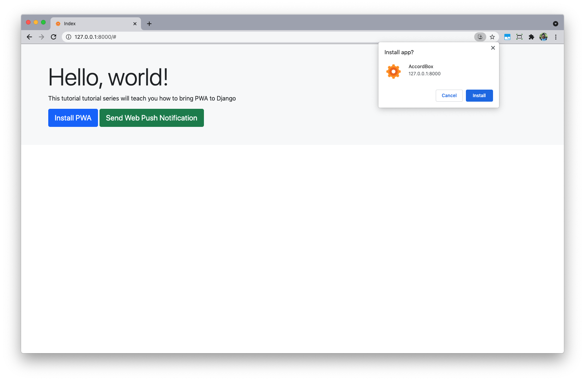
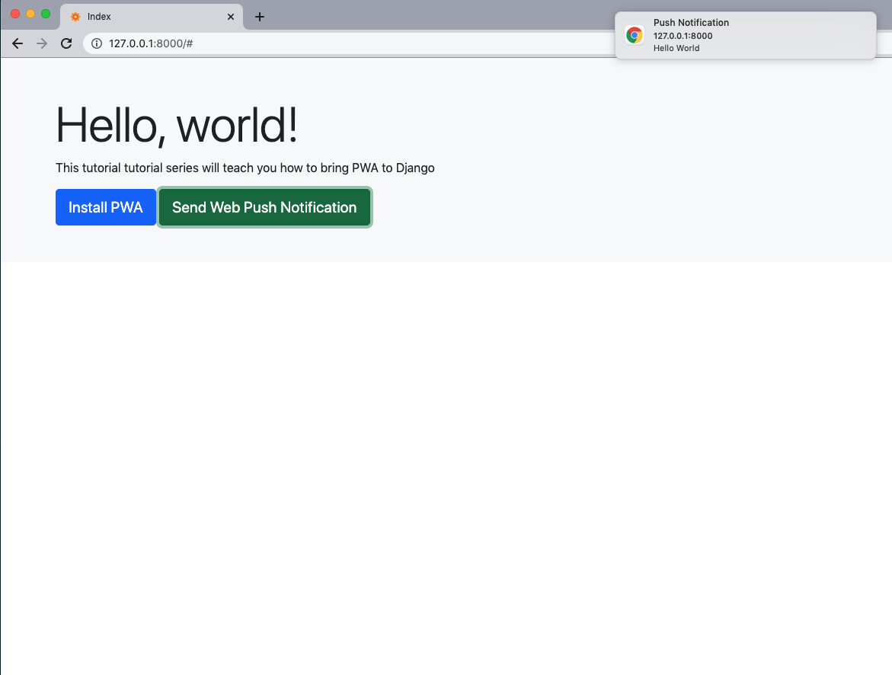

# README

## Introduction

[Django PWA Tutorial](https://www.accordbox.com/blog/django-pwa-tutorial/)

This project will teach you, how to use the **mordern frontend tech** to add (Progressive Web App) features to Django.

Features:

1. Favicons generation without 3-party services.
1. Fallback offline page.
1. Precaching static assets.
1. Install PWA.
1. Web Push Notification.

## Run on local

### Solution 1 (Docker)

You need Docker and Docker Compose and you can install it here [Get Docker](https://docs.docker.com/get-docker/)

```bash
$ git clone https://github.com/AccordBox/django-pwa-demo
$ cd django-pwa-demo

$ docker-compose build
$ docker-compose run --rm web vapid --applicationServerKey

No private_key.pem file found.
Do you want me to create one for you? (Y/n)y
Generating private_key.pem
Generating public_key.pem
Application Server Key = XXXXXXXXXXXXXXXXXXXXXXXXXXXXX
```

Copy the Above `Application Server Key` to the `PUSH_NOTIFICATIONS_SETTINGS.APP_SERVER_KEY` of `django_pwa_app/settings.py`

```python
PUSH_NOTIFICATIONS_SETTINGS = {
    'WP_CLAIMS': {
        "sub": "mailto: michaelyin@accordbox.com"
    },
    'WP_ERROR_TIMEOUT': 10,  # timeout for the request on the push server
    'UPDATE_ON_DUPLICATE_REG_ID': True,
    'APP_SERVER_KEY': 'XXXXXXXXXXXXXXXXXXXXXXXXXXXXX',
    'WP_PRIVATE_KEY': 'private_key.pem',
}
```

```bash
$ docker-compose up

frontend_1  | webpack 5.24.2 compiled successfully in 7972 ms
frontend_1  | ℹ ｢wdm｣: Compiled successfully.

# check on http://127.0.0.1:8000/
```

### Solution 2

```bash
$ git clone https://github.com/AccordBox/django-pwa-demo
$ cd django-pwa-demo

$ pip install -r requirements.txt
$ vapid --applicationServerKey

No private_key.pem file found.
Do you want me to create one for you? (Y/n)y
Generating private_key.pem
Generating public_key.pem
Application Server Key = XXXXXXXXXXXXXXXXXXXXXXXXXXXXX
```

Copy the Above `Application Server Key` to the `PUSH_NOTIFICATIONS_SETTINGS.APP_SERVER_KEY` of `django_pwa_app/settings.py`

```python
PUSH_NOTIFICATIONS_SETTINGS = {
    'WP_CLAIMS': {
        "sub": "mailto: michaelyin@accordbox.com"
    },
    'WP_ERROR_TIMEOUT': 10,  # timeout for the request on the push server
    'UPDATE_ON_DUPLICATE_REG_ID': True,
    'APP_SERVER_KEY': 'XXXXXXXXXXXXXXXXXXXXXXXXXXXXX',
    'WP_PRIVATE_KEY': 'private_key.pem',
}
```

If you have no nodejs installed, please install it first by using below links

1. On [nodejs homepage](https://nodejs.org/en/download/)
1. Using [nvm](https://github.com/nvm-sh/nvm) I recommend this way.

```bash
$ cd frontend
$ npm install
$ npm run watch

# in another terminal
$ python manage.py migrate
$ python manage.py runserver

# check on http://127.0.0.1:8000/
```

## Screenshot




